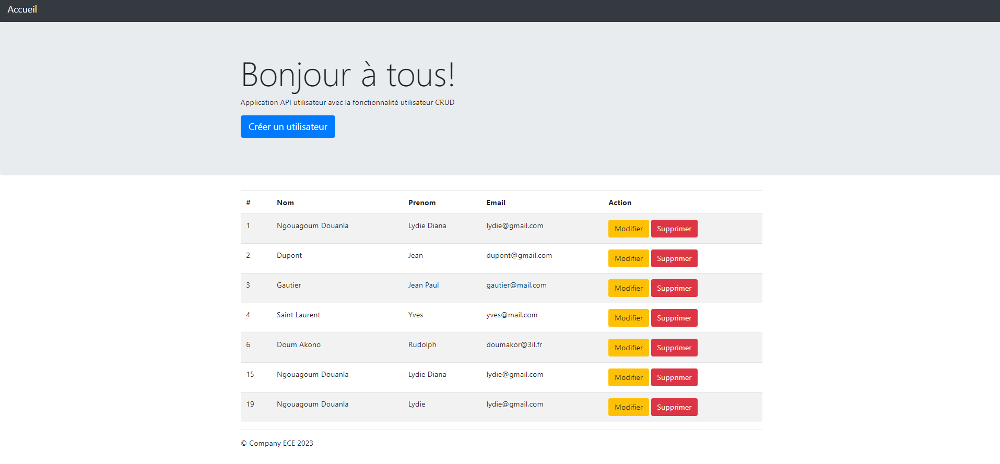
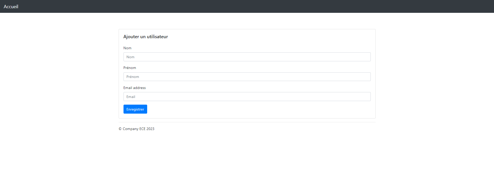
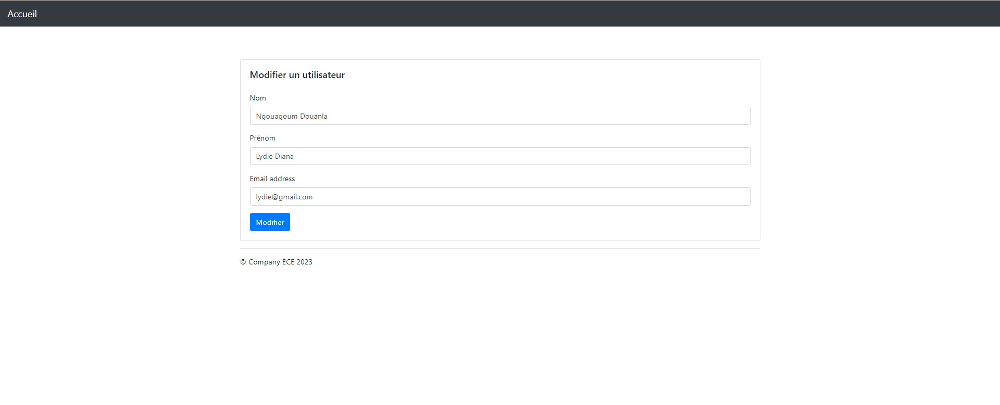
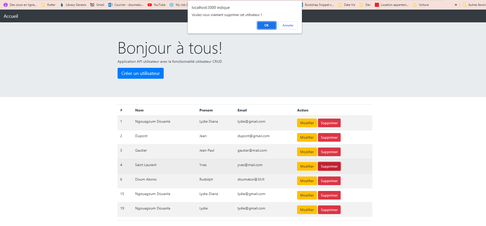

# Application web API utilisateur

Il s'agit d'une application web NodeJS de base exposant une API REST qui crée et stocke les paramètres utilisateur dans une base de données Redis.
## Fonctionnalités
- Démarrer un serveur web
- Créer un utilisateur
- Obtenir un utilisateur
## Installation
Cette application est écrite en NodeJS et utilise une base de données Redis.

- Installer NodeJS
- Installer Redis
- Installer l'application
Aller dans le répertoire racine de l'application (où se trouve le fichier **`package.json`**) et exécuter :

```bash
  npm install
```
## Utilisation

### Démarrer un serveur web
À partir du répertoire racine du projet, exécuter :

```bash
  npm start
```
Cela démarrera un serveur web disponible dans votre navigateur à l'adresse http://localhost:3000.

### Créer un utilisateur
Envoyer une demande POST (protocole REST) en utilisant le terminal :
```bash
  curl --header "Content-Type: application/json" \
  --request POST \
  --data '{"username":"sergkudinov","firstname":"sergei","lastname":"kudinov"}' \
  http://localhost:3000/user

```
Le résultat affichera :

```bash
{"status":"success","msg":"OK"}
```

Une autre façon de tester votre API REST est d'utiliser Postman.

### Tests
À partir du répertoire racine du projet, exécuter :

```bash
npm test
```
## Screenshots
### Liste des utilisateurs


### Ajout d'un nouvel utilisateur



### Modification d'un utilisateur


### Suppression d'un utilisateur


## Pipeline CI/CD avec GitHub Actions
Pour créer un pipeline CI/CD efficace, voici les éléments importants à prendre en compte :

1- **Gestion du code source** : Vous devez choisir une plateforme de gestion du code source telle que Git (par exemple, GitHub, GitLab, Bitbucket) pour héberger votre code et le versionner.

2- **Tests automatisés** : Vous devez inclure des tests automatisés pour vérifier la qualité et la stabilité de votre code. Cela peut inclure des tests unitaires, des tests d'intégration, des tests fonctionnels, des tests de performance, etc.

3- **Intégration continue** (CI) : Configurez un processus d'intégration continue pour automatiser la compilation, les tests et la validation de votre code à chaque modification. Cela garantit que le code nouvellement ajouté ou modifié est intégré au code existant en évitant les conflits et les problèmes d'intégration.

4- **Déploiement continu** (CD) : Automatisez le déploiement de votre application ou de vos services après la réussite des tests automatisés et de l'intégration continue. Cela implique la création d'un pipeline pour déployer votre application sur les environnements de développement, de test, de pré-production et de production de manière transparente.

5- **Infrastructure en tant que code (IaC)** : Utilisez des outils tels que Terraform ou CloudFormation ou bien Docker pour définir votre infrastructure en tant que code. Cela permet de créer et de gérer votre infrastructure de manière cohérente et reproductible, en évitant les erreurs manuelles et les configurations incorrectes.

```bash
name: User API CI/CD Pipeline

on:
push:
branches:
- main

jobs:
build:
runs-on: ubuntu-latest

    steps:
      - name: Checkout Repository
        uses: actions/checkout@v2

      - name: Set up Node.js
        uses: actions/setup-node@v2
        with:
          node-version: 14

      - name: Install Dependencies
        run: npm install

      - name: Set up MySQL Database
        run: |
          mysql -e "CREATE DATABASE userapi;"
          mysql -e "USE userapi;"
          mysql -e "GRANT ALL PRIVILEGES ON userapi.* TO 'root'@'localhost' IDENTIFIED BY 'root';"

      - name: Run Tests
        run: npm test

      - name: Build and Deploy
        run: npm run build && npm run deploy

```
### Explication du code :
- **name**: CI/CD Pipeline: C'est le nom donné au pipeline CI/CD. Vous pouvez le personnaliser selon vos besoins.

- **on**: Cela spécifie les déclencheurs qui activent l'exécution du pipeline. Dans cet exemple, le pipeline est déclenché à chaque push sur la branche principale (main).

- **jobs**: Les jobs sont les tâches exécutées dans le pipeline.

- **build**: C'est le nom du job. Vous pouvez le renommer en fonction de votre utilisation.

- **runs-on**: ubuntu-latest: Spécifie l'environnement d'exécution du job. Dans cet exemple, le job s'exécute sur une machine virtuelle Ubuntu.

- **steps**: Ce sont les étapes à exécuter dans le job.

- **Checkout Repository**: Cette étape utilise l'action actions/checkout pour récupérer le code source du référentiel.

- **Set up Node.js**: Cette étape utilise l'action actions/setup-node pour configurer l'environnement Node.js. Dans cet exemple, la version 14 de Node.js est utilisée.

- **Install Dependencies**: Cette étape exécute la commande npm install pour installer les dépendances du projet.

- **Run Tests**: Cette étape exécute la commande npm test pour exécuter les tests automatisés du projet.

- **Build and Deploy**: Cette étape exécute les commandes npm run build et npm run deploy pour construire l'application et la déployer. Vous pouvez personnaliser ces commandes en fonction des besoins de votre projet.

## Configuration du Vagrantfile
```bash
Vagrant.configure("2") do |config|
  config.vm.box = "generic/ubuntu2004"
  config.vm.network "private_network", ip: "192.168.43.10"
  
  config.vm.provider "virtualbox" do |vb|
    vb.memory = "2048"  # Définit la RAM à 2048 Mo
    vb.cpus = 2         # Définit le nombre de CPU à 2
  end

  config.vm.provision "ansible" do |ansible|
    ansible.playbook = "provision.yml"
  end
end
```

### Explication
Ce fichier Vagrantfile utilise la box "generic/ubuntu2004" qui est une image Ubuntu 20.04 générique. Vous pouvez également choisir une autre box appropriée pour votre distribution Linux préférée.

La machine virtuelle est configurée avec une interface réseau privée ayant l'adresse IP "192.168.43.10". Vous pouvez modifier cette adresse IP en fonction de vos besoins.

La section "config.vm.provision" indique à Vagrant d'utiliser Ansible pour la provision de la machine virtuelle.

### Image Docker de notre application
```bash
#Image de base appropriée pour notre application
FROM node:14

# Le répertoire de travail dans le conteneur
WORKDIR /app

# Copie des fichiers de notre application dans le conteneur
COPY package.json package-lock.json /app/
COPY conf /app/conf
COPY src /app/src

# Installation des dépendances de l'application
RUN npm ci --production

# Port sur lequel notre application écoute
EXPOSE 3000

# Démarrage notre application lorsque le conteneur démarre
CMD ["npm", "start"]
```

### 🔗 Lien vers l'image docker dans Docker Hub
https://hub.docker.com/repository/docker/lydiediana/userapi/general


## Orchestration des conteneurs à l'aide de Docker Compose

```bash
version: '3'
services:
  app:
    image: lydiediana/userapi
    ports:
      - 3000:3000
    environment:
      - DB_HOST=db
      - DB_USER=root
      - DB_PASSWORD=root
      - DB_DATABASE=userapi
    depends_on:
      - db
  db:
    image: mysql:latest
    environment:
      - MYSQL_ROOT_PASSWORD=root
      - MYSQL_DATABASE=userapi
    volumes:
      - ./data:/var/lib/mysql
```